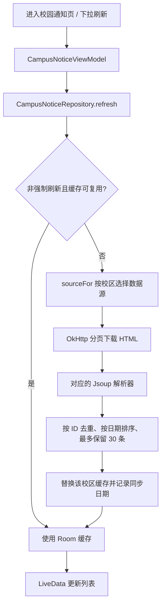

# HITA 校园通知抓取实现参考

本文供 `astrbot_plugin_monitor_notifications` 项目开发参考，整理 HITA Android 当前的抓取路径、解析规则、登录处理和缓存策略。

- 整理日期：2026-10-07。
- 源码目录：`/home/youyi/ai-coding/codex/hita/HITA_Android`。
- 源码版本：`4b93bd8bb226ae2d24b831487701deb70f28988c`。
- 依据：本地源码和已有测试；未实测学校网站当前的页面结构、网络可达性或登录行为，也未运行测试。
- 当前仓库未配置 `upstream`，因此未完成上游版本对比。

## 1. 核心实现

HITA 在 Android 客户端直接抓取学校通知列表：使用 OkHttp 下载 HTML，使用 Jsoup 按校区解析，统一转换为通知数据，再写入 Room 数据库供页面观察。

这条调用链没有经过 HITA 的 AI 后端；抓取范围为列表中的标题、链接和发布日期，正文在用户点击后通过 `Intent.ACTION_VIEW` 打开原网页。



主要调用关系：

```text
BlogFragment
  → CampusNoticeViewModel.syncOnPageOpen(campus) / refresh(campus)
  → CampusNoticeRepository.refresh(campus, force)
  → sourceFor(campus)
  → fetchLatestNotices(source)
      → source.listPageUrl(page)
      → download(url)
      → source.parse(html, url)
  → CampusNoticeDao.replaceAll(campus, notices)
```

## 2. 三校区数据源与解析规则

| 项目 | 深圳 | 本部 | 威海 |
| --- | --- | --- | --- |
| 校区标识 | `SHENZHEN` | `BENBU` | `WEIHAI` |
| 解析器 | `CampusNoticeParser` | `BenbuNoticeParser` | `WeihaiNoticeParser` |
| 列表首页 | `https://info.hitsz.edu.cn/list.jsp?urltype=tree.TreeTempUrl&wbtreeid=1053` | `https://today.hit.edu.cn/category/10` | `http://today.hitwh.edu.cn/1024/list.htm` |
| 第二页 | 首页 URL 追加 `&PAGENUM=2` | 首页 URL 追加 `?page=1` | `http://today.hitwh.edu.cn/1024/list2.htm` |
| 最多抓取页数 | 3 | 2 | 3 |
| 最多保留条数 | 30 | 30 | 30 |
| 当前解析器版本 | 2 | 1 | 1 |
| 通知 ID | `wbnews:<wbnewsid>` | `hit:<articleId>` | `hitwh:<articleId>` |

### 2.1 深圳

1. 用 `Jsoup.parse(html, baseUrl)` 解析页面，选择 `div.Newslist, .Newslist` 中第一个匹配元素。
2. 遍历该区域内的 `a[href]`，用 `absUrl("href")` 补全相对链接，并去掉 URL 片段。
3. 仅保留含 `wbnewsid` 且包含 `NewsContentUrl` 或 `content.jsp` 的链接，排除 JavaScript 链接和统一认证链接。
4. 标题优先取 `<a title="...">`，缺失时取链接文字；清理不换行空格和连续空白，过滤长度小于 4 的标题。
5. 优先从链接父元素内第一个 `span` 提取日期，失败时从父元素完整文本提取。日期正则支持 `-`、`/`、`.` 和中文年月分隔，按 `Asia/Shanghai` 转为毫秒时间戳，失败返回 `0`。
6. 从 URL 提取 `wbnewsid` 构造稳定 ID，并将正文链接规范化为：

```text
https://info.hitsz.edu.cn/content.jsp?urltype=news.NewsContentUrl&wbtreeid=<分类ID>&wbnewsid=<通知ID>
```

缺少 `wbtreeid` 时使用 `1023`。同页出现重复 ID 时，允许有有效日期的记录替换没有日期的记录。

### 2.2 本部

1. 列表根节点为 `ul.paragraph.list-tooltip`，通知链接选择器为 `span.title a[href]`。
2. 从链接路径 `/article/(20\d{2})/(\d{2})/(\d{2})/(\d+)` 提取年月日和文章 ID。
3. 列表页面显示的“2 小时前”等相对时间不参与解析，发布日期取自 URL 路径，时区为 `Asia/Shanghai`。
4. 标题优先取链接的 `title` 属性，否则取链接文字；清理空白并过滤短标题。
5. 生成 `hit:<articleId>`，将链接规范化到 `https://today.hit.edu.cn/article/yyyy/MM/dd/id`。

### 2.3 威海

1. 列表根节点为 `div.list_list_wrap`，遍历 `ul > li`，每项取第一个 `a[href]`。
2. 用正则 `/(\d{4,})/c\d+a(\d+)/page\.htm` 从链接中提取文章 ID，生成 `hitwh:<articleId>`。
3. 标题优先取链接的 `title` 属性，以获取未截断的标题；清理空白并过滤短标题。
4. 日期来自当前列表项的 `span.news-time2`，按 `yyyy-MM-dd`、`Asia/Shanghai` 解析，失败返回 `0`。
5. 仅接受以单个 `/` 开头的站内路径，排除 `//`、含 `@` 或反斜杠的路径，再拼接 `http://today.hitwh.edu.cn`。

源码注释说明该列表每页 14 条，因此最多抓 3 页以覆盖 30 条的目标数量。

### 2.4 通用汇总行为

- 单页解析结果和跨页结果都按通知 ID 去重。
- 页面解析结果为空时停止翻页；累计达到 30 条时也停止。
- 最终按 `pubDateMillis` 降序、`title` 升序排序，截取前 30 条。
- 这是有限页数内的最新列表缓存，不是全站历史采集；并不保证每次一定得到 30 条。
- 日期只有天级精度；同一天内使用标题排序，不能据此判断精确发布时间。

## 3. HTTP 请求与深圳登录

`CampusNoticeRepository` 使用 `Executors.newSingleThreadExecutor()` 将抓取和数据库操作放到后台线程。

OkHttp 配置如下：

- 连接超时 20 秒，读取超时 45 秒。
- 允许 HTTP 和 HTTPS 重定向，启用连接失败重试。
- 请求方式为 GET。
- `User-Agent` 使用 Android Chrome 风格并附带 `HITA/<版本号>`。
- `Accept` 为 `text/html,application/xhtml+xml`。
- 成功响应读取 `response.body.string()` 作为 HTML。

深圳请求会从 Android WebView 的 `CookieManager` 读取目标 URL 的 Cookie，在 Cookie 非空且 URL 包含 `info.hitsz.edu.cn` 时加入请求头。

登录流程：

1. 请求最终 URL 包含 `ids.hit.edu.cn`、`/authserver/` 或 `caslogin`，或状态码为 401～403 时，抛出登录异常。
2. 深圳校区将该异常映射为 `NEED_LOGIN`，页面提供门户登录入口；本部和威海映射为普通失败。
3. `InfoPortalLoginActivity` 使用启用 JavaScript、DOM Storage 和 Cookie 的 WebView 打开深圳通知列表。
4. 用户完成认证、页面返回深圳门户后，延迟 800 毫秒调用 `CookieManager.flush()`，以成功结果关闭登录页。
5. `BlogFragment` 收到成功结果后强制刷新深圳通知，再由 OkHttp 携带已保存的 Cookie 下载列表。

补充边界：

- 教务登录决定资讯页是否显示；门户登录 Cookie 用于深圳通知请求，两者用途不同。
- `hasPortalCookie()` 只检查 Cookie 是否含 `JSESSIONID` 或 `iPlanetDirectoryPro`，不证明会话有效。
- 登录页通过返回门户 URL 判断成功；最终能否抓到通知仍由后续请求决定。
- `InfoPortalLoginActivity` 中保留了 `EXTRACT_JS`，但当前没有执行它；实际抓取路径是 OkHttp + Jsoup。
- 本部、威海这条请求路径没有附加深圳门户 Cookie 的逻辑；网站实际访问要求需部署时验证。

## 4. 刷新、缓存和错误处理

### 4.1 刷新时机

- 深圳：进入资讯页中的“校园通知”子页时调用 `syncOnPageOpen()`。
- 本部、威海：进入资讯页的通知界面时调用 `syncOnPageOpen()`。
- 下拉刷新、点击重试、深圳门户登录成功后调用强制刷新。
- 这条链路中没有校园通知的定时轮询任务或新通知推送逻辑。

非强制刷新只有同时满足以下条件才跳过网络：缓存通过当前代码的有效性判断、上海时区当天已成功抓取、已记录的解析器版本不低于当前版本。缓存为空、缓存无有效记录或解析器版本提升时会重新抓取。

各校区在 SharedPreferences 中独立记录 `last_fetch_day_<campus>` 和 `parser_version_<campus>`。此机制是页面访问时的每日节流，并非每天定时执行。

### 4.2 数据结构与持久化

```kotlin
data class CampusNotice(
    val campus: String,
    val id: String,
    val title: String,
    val url: String,
    val pubDateMillis: Long,
)
```

Room 表为 `campus_notice`，联合主键为 `(campus, id)`，`pubDateMillis` 建有索引。

成功抓取到非空结果后，在事务内删除该校区旧记录，再插入最多 30 条新记录，并更新同步日期和解析器版本。UI 通过按校区查询的 LiveData 观察列表。

### 4.3 失败处理

- 解析结果为空：如果旧缓存有效，保留旧数据并清除错误提示；没有可用缓存时，深圳且缺少门户 Cookie 则提示登录，否则提示失败。
- 登录异常：保留有效缓存；深圳提示登录，本部、威海提示失败。
- DNS 解析失败或读取超时：分类为 `NEED_CAMPUS_NET`，当前 UI 文案提示检查网络；这一枚举名称不能证明故障一定由未连接校园网引起。
- 其他异常：分类为 `FAILED`，保留有效缓存。
- 非 2xx 且不属于 401～403 的 HTTP 响应抛出 `IOException`。

`cacheIsJunk()` 的实现是“缓存为空，或没有任何一条记录通过数据源校验”；它不保证缓存中的每一条记录都有效。分页过程中发生异常会中止本次抓取，已解析的前几页不会单独写入缓存。

## 5. 用于通知监控插件时的适配点

本节是基于上述实现的开发建议，不代表 HITA 已有功能。

可复用三校区的数据源、分页规则、选择器、日期解析和稳定 ID；建议继续保留“数据源适配器 → HTTP 下载 → 纯解析函数 → 统一通知模型”的边界，让各校区页面变化时只修改对应解析器。

监控插件需要额外实现以下行为：

| 需求 | HITA 当前行为 | 插件适配方向 |
| --- | --- | --- |
| 自动监控 | 打开页面触发，成功后按天节流 | 增加可配置定时调度、请求超时与失败退避；不能直接沿用每日页面缓存作为监控频率 |
| 新通知判定 | 用 ID 去重后替换最近 30 条 | 持久化 `(campus, id)` 和首次发现时间，通过 ID 集合差计算新通知 |
| 防止重复推送 | 没有推送记录 | 分开保存抓取记录和每个订阅目标的发送状态；发送失败可重试 |
| 首次启动 | 展示当前列表 | 明确首次是否仅建立基线，避免一次推送所有历史条目 |
| 漏抓控制 | 固定最多 2～3 页、30 条 | 根据更新量支持翻页直到已知记录或配置上限，明确停机较久时有限窗口可能遗漏通知 |
| 登录会话 | Android WebView 与 CookieManager | 服务端需要独立的授权会话输入、保存和过期提示；Android Cookie 机制不能直接搬用 |
| 页面变化 | 空结果可能回退旧缓存并隐藏错误 | 区分页面结构变化、登录页、空列表和网络失败，避免把解析失败记录为同步成功 |
| 正文或附件 | 仅抓取列表元数据 | 如产品需要，另行增加详情页解析和附件处理 |

监控判重应以稳定 ID 为主，不宜仅比较日期或“最新一条”的位置，因为列表可能置顶、跨页重复，同一天通知也没有精确到时分秒的时间信息。若要监控既有通知的内容更新，应额外保存内容摘要或版本状态。

## 6. 源码与已有测试索引

以下链接以本文件所在的 `astrbot_plugin_monitor_notifications` 目录为基准，指向相邻的 HITA 源码目录；移动文档后需要调整。

| 文件 | 用途 |
| --- | --- |
| [CampusNoticeRepository.kt](../hita/HITA_Android/app/src/main/java/cn/limpu/hita/data/repository/CampusNoticeRepository.kt) | 校区路由、网络请求、分页汇总、缓存与错误处理 |
| [CampusNoticeParser.kt](../hita/HITA_Android/app/src/main/java/cn/limpu/hita/data/source/web/notice/CampusNoticeParser.kt) | 深圳 URL、列表选择器、日期与 ID 解析 |
| [BenbuNoticeParser.kt](../hita/HITA_Android/app/src/main/java/cn/limpu/hita/data/source/web/notice/BenbuNoticeParser.kt) | 本部列表与路径日期解析 |
| [WeihaiNoticeParser.kt](../hita/HITA_Android/app/src/main/java/cn/limpu/hita/data/source/web/notice/WeihaiNoticeParser.kt) | 威海列表、站内路径与日期解析 |
| [CampusNotice.kt](../hita/HITA_Android/app/src/main/java/cn/limpu/hita/data/model/notice/CampusNotice.kt) | 通知数据模型与 Room 实体 |
| [CampusNoticeDao.kt](../hita/HITA_Android/app/src/main/java/cn/limpu/hita/data/source/dao/CampusNoticeDao.kt) | 按校区查询和事务替换缓存 |
| [CampusNoticePreferenceSource.kt](../hita/HITA_Android/app/src/main/java/cn/limpu/hita/data/source/preference/CampusNoticePreferenceSource.kt) | 每校区同步日期和解析器版本 |
| [CampusNoticeViewModel.kt](../hita/HITA_Android/app/src/main/java/cn/limpu/hita/ui/main/blog/CampusNoticeViewModel.kt) | 页面到仓库的调用入口 |
| [BlogFragment.kt](../hita/HITA_Android/app/src/main/java/cn/limpu/hita/ui/main/blog/BlogFragment.kt) | 自动刷新、手动刷新、登录回调和打开通知链接 |
| [InfoPortalLoginActivity.kt](../hita/HITA_Android/app/src/main/java/cn/limpu/hita/ui/notice/InfoPortalLoginActivity.kt) | 深圳门户 WebView 登录与 Cookie 保存 |
| [MainTab.kt](../hita/HITA_Android/app/src/main/java/cn/limpu/hita/ui/main/MainTab.kt) | 三校区资讯页可见性；博客内容仅深圳可见 |
| [CampusNoticeParserTest.kt](../hita/HITA_Android/app/src/test/java/cn/limpu/hita/data/source/web/notice/CampusNoticeParserTest.kt) | 深圳解析、导航过滤、分页、30 条上限与页面样本回归 |
| [BenbuNoticeParserTest.kt](../hita/HITA_Android/app/src/test/java/cn/limpu/hita/data/source/web/notice/BenbuNoticeParserTest.kt) | 本部解析、排序去重、分页和无效结构处理 |
| [WeihaiNoticeParserTest.kt](../hita/HITA_Android/app/src/test/java/cn/limpu/hita/data/source/web/notice/WeihaiNoticeParserTest.kt) | 威海标题、日期、分页、条数上限和异常路径过滤 |
| [hitsz_notice_list_p1.html](../hita/HITA_Android/app/src/test/resources/hitsz_notice_list_p1.html) | 深圳通知列表 HTML 测试样本 |

README 仍描述“资讯仅深圳登录后出现”，但上述代码已经支持三校区通知；开发时应以当前实现和验证后的页面结构为准。
